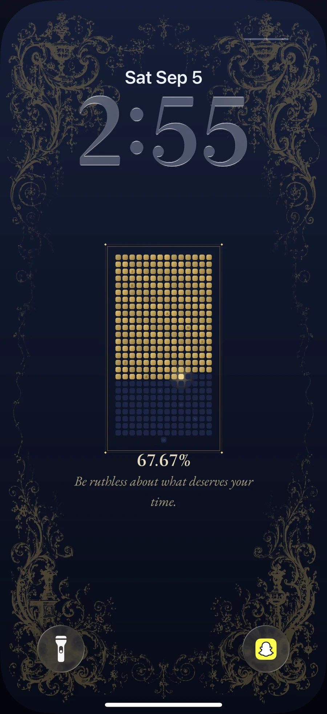

# your year, on your lock screen.

365 small squares. one for every day.

the days behind you turn gold. today glows. the rest wait in the dark.

every morning, your lock screen quietly reminds you that the year is moving.

<p align="center">
  
</p>

## what you're looking at

- one square for every day of the year
- gold squares for completed days
- one brighter square for today
- dark blue squares for the days ahead
- a live percentage of the year completed
- a different quote each day
- a fresh wallpaper every night

made for iPhone 11 and newer. the preview above is from an iPhone 17 Pro.

## put it on your iPhone

this takes about two minutes. you only need Apple's **Shortcuts** app.

### 1. make the shortcut

Copy this URL:

```text
https://wallpaper-ashen-three.vercel.app/api/wallpaper
```

Then:

1. Open **Shortcuts** on your iPhone.
2. Tap **+** to create a new shortcut.
3. Tap **Add Action**.
4. Search for **Get Contents of URL** and add it.
5. Paste the URL above into its URL field. Leave the method as **GET**.
6. Add one more action. Search for **Set Wallpaper** and add it.
7. Make sure the image in that action says **Contents of URL**.
8. Tap the **Wallpaper** field and choose the Lock Screen you want this to update.
9. Open the action's options and turn **Show Preview** off.
10. Name the shortcut **Year Wallpaper**.

Your shortcut should contain exactly two actions:

```text
Get Contents of URL
        ↓
Set Wallpaper to Contents of URL
```

Tap the play button once. Approve the network and wallpaper permissions if iOS asks. Lock your phone and make sure the wallpaper appears.

### 2. make it update every night

1. Open the **Automation** tab in Shortcuts.
2. Tap **+**, then choose **Time of Day**.
3. Pick a time just after midnight, such as **12:05 AM**.
4. Set it to repeat **Daily**.
5. Choose **Run Immediately**. On older iOS versions, turn **Ask Before Running** off instead.
6. Select the **Year Wallpaper** shortcut.
7. Tap **Done**.

that's it. your lock screen now updates itself every day.

## if something feels off

**The wallpaper opens a preview every night**

Edit the shortcut, open the **Set Wallpaper** options, and turn **Show Preview** off.

**The wrong Lock Screen changes**

Edit the shortcut and tap the **Wallpaper** field inside **Set Wallpaper**. Choose the correct Lock Screen.

**The image does not load**

Open the [wallpaper URL](https://wallpaper-ashen-three.vercel.app/api/wallpaper) in Safari. If it loads there, run the shortcut again and accept any permission prompt.

**The day is wrong while using a VPN**

The wallpaper normally uses your local timezone. A VPN can confuse that detection. Add your timezone to the URL, like this:

```text
https://wallpaper-ashen-three.vercel.app/api/wallpaper?tz=America/New_York
```

## want your own copy?

You can run the exact same wallpaper from your own Vercel account. No database, API key, or paid service is required.

[](https://vercel.com/new/clone?repository-url=https%3A%2F%2Fgithub.com%2Fardotnav%2Fwallpaper)

After it deploys, Vercel gives you a URL. Add `/api/wallpaper` to the end and use that URL in the shortcut.

keep going. the squares will take care of themselves.
